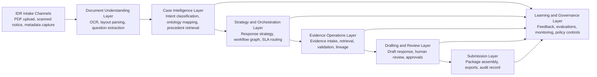

# Architecture Overview

## Purpose

This architecture describes an AI-assisted tax audit investigation and response orchestration platform for handling Individual Document Requests (IDRs). It is not a chatbot architecture. The platform's job is to convert unstructured audit requests into governed investigation plans, evidence-backed draft responses, and submission-ready audit packages with full traceability.

## Scope

The architecture covers:

- logical architecture
- current-state and target-state operating model
- AI service flow
- task orchestration flow
- evidence lineage flow
- human-in-the-loop review flow
- package generation flow
- learning feedback loop

## Source Basis

This documentation is derived from:

- `audit_idr_genai_brd_codex.md`
- `extracted_knowledge/01_brd_summary.md`
- `extracted_knowledge/ontology/*`
- OCR-derived workflow and architecture notes in `extracted_knowledge/ocr_outputs/*`

## Architectural Positioning

The platform should be understood as an audit workbench with AI-assisted understanding, planning, retrieval, drafting, validation, and orchestration. The system optimizes for defensibility, traceability, and controlled human judgment.

## End-to-End Capability Chain

```text
IDR PDF
  -> OCR + Parsing
  -> Question Extraction
  -> Intent Classification
  -> Ontology Mapping
  -> Historical Precedent Retrieval
  -> Response Strategy Generation
  -> Task Explosion / Workflow Graph
  -> Evidence Collection
  -> Evidence Sufficiency Validation
  -> Draft Response Generation
  -> Human Review
  -> Submission Package
  -> Learning Feedback Loop
```

## Logical Architecture



## Primary Architectural Principles

- Model the audit request as a structured case, not only as a document.
- Generate response strategy before response draft generation.
- Treat tasks, evidence, reviews, and approvals as first-class objects.
- Preserve source-to-response lineage for every material claim.
- Keep humans in approval control at question confirmation, evidence acceptance, draft approval, and package release.
- Use AI to assist orchestration and judgment preparation, not to replace accountable reviewers.

## Core Domain Objects

- IDR / Notice
- Question / Sub-question
- Ontology classification set
- Precedent / Template / Playbook reference
- Response strategy
- Task / Workflow node
- Evidence artifact / Evidence pack
- Sufficiency assessment
- Draft response
- Review decision / Approval
- Submission package
- Feedback outcome

## Operating Model Summary

- Intake converts an external government request into a structured case.
- Understanding services break the request into discrete question objects.
- AI services classify each question and propose strategy.
- Orchestration converts strategy into executable work across teams.
- Evidence operations gather, validate, and track support artifacts.
- Drafting services generate responses grounded in accepted evidence.
- Human reviewers edit, approve, reject, or return work for further investigation.
- Submission services assemble regulator-facing packages plus internal audit record.
- Feedback services update precedent quality, ontology coverage, and workflow heuristics.
