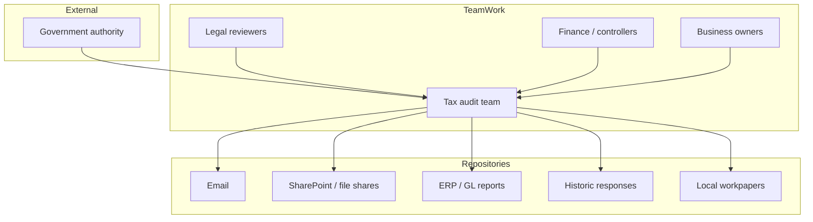

# Current State Architecture

## Summary

The current state is a fragmented, document-centric process with limited system orchestration. Work begins with an IDR PDF or scanned notice, but most downstream interpretation, planning, evidence collection, drafting, and review activities are manual or loosely coordinated across teams and repositories.

## Current-State Characteristics

- IDRs often arrive as PDFs or scans and require OCR before use.
- Question extraction is manual or semi-manual.
- Prior responses and evidence are difficult to locate and compare.
- Audit strategy lives in tax team judgment rather than a structured system object.
- Task planning is handled through ad hoc ownership and follow-up.
- Evidence is spread across email, file shares, workpapers, reports, and institutional memory.
- Traceability from source evidence to final answer is inconsistent.
- Review and package assembly happen late and uncover issues late.

## Current-State Process Flow

```mermaid
flowchart LR
    A[Audit notice / IDR PDF] --> B[Manual OCR or document reading]
    B --> C[Manual question interpretation]
    C --> D[Tax-led planning and decomposition]
    D --> E[Email / spreadsheet / offline task assignment]
    E --> F[Evidence collection from multiple systems and owners]
    F --> G[Manual reconciliation and sufficiency checks]
    G --> H[Draft response in docs / workpapers]
    H --> I[Tax / legal / leadership review]
    I --> J[Manual package assembly and submission]
```

## Current Logical Landscape

## Current Pain Points by Stage

### Intake and Understanding

- OCR quality varies.
- Layout context and page lineage are not consistently preserved.
- Compound questions are hard to split cleanly.

### Investigation Planning

- Similar historical questions are not systematically reused.
- Request interpretation differs by individual reviewer.
- Risk and evidence needs are not encoded in a repeatable strategy object.

### Task Execution

- Tasks are tracked as lists rather than dependency graphs.
- Ownership boundaries between document owner, task owner, reviewer, and tax lead are ambiguous.
- No consistent SLA or exception management model exists.

### Evidence Operations

- Evidence comes from heterogeneous systems and formats.
- Evidence acceptance criteria are informal.
- Contradictions and missing support are discovered late.

### Drafting and Review

- Drafts are often produced before evidence is truly complete.
- Review comments are hard to connect back to source claims and evidence.
- Edits and approvals are not always captured in a durable case history.

### Packaging and Submission

- Attachments and narrative packages are assembled manually.
- Regulator-facing packages and internal evidence records are not consistently aligned.

## Current-State Flow From OCR-Derived Materials

The extracted workflow artifacts reinforce a sequence like:

- read audit notice
- create document request
- assign owners and tasks
- collect evidence
- review and consolidate responses
- finalize submission

The extracted current architecture notes also indicate an early concept of:

- asynchronous ingestion
- embeddings / indexing
- response plan generation
- response drafting

However, these are not yet represented as a cohesive governed platform.

## Current-State Risks

- inconsistent response quality across audits
- late discovery of missing evidence
- weak audit defensibility
- poor reuse of accepted prior responses
- limited transparency into AI or manual decision provenance
- high manual coordination cost

## Architectural Implication

The target state must move from a document-processing workflow to a case-centric orchestration system with explicit strategy objects, evidence lineage, review gates, and a persistent system of audit record.
