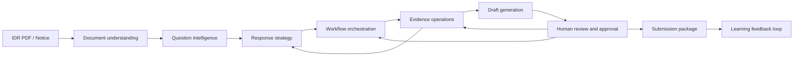
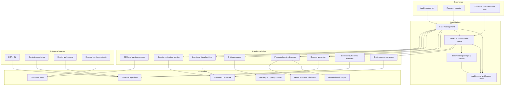

# Target State Architecture

## Summary

The target state is an AI-assisted tax audit investigation and response orchestration platform. It ingests IDR notices, creates structured case objects, plans evidence-backed response strategies, coordinates cross-team work through workflow graphs, validates sufficiency, supports governed human review, and assembles submission-ready packages with full lineage.

## Target Operating Model

## Target Logical Architecture

## Mandatory Flow Coverage

The target architecture explicitly supports:

- logical architecture
- data flow
- AI service flow
- human-in-the-loop review flow
- evidence lineage flow
- task orchestration flow
- package generation flow

## End-to-End Target Flow

```mermaid
flowchart LR
    A[IDR PDF] --> B[OCR + parsing]
    B --> C[Question extraction]
    C --> D[Intent classification]
    D --> E[Ontology mapping]
    E --> F[Historical precedent retrieval]
    F --> G[Response strategy generation]
    G --> H[Task explosion / workflow graph]
    H --> I[Evidence collection]
    I --> J[Evidence sufficiency validation]
    J --> K[Draft response generation]
    K --> L[Human review]
    L --> M[Submission package]
    M --> N[Learning feedback loop]
```

## Human-in-the-Loop Review Model

- Humans confirm extracted questions when confidence is low or impact is high.
- Humans approve or adjust strategy for sensitive questions.
- Humans adjudicate evidence gaps, contradictions, and alternative interpretations.
- Humans approve response drafts before submission release.
- Humans own final package approval.

## Architectural Controls

- confidence gating on extraction, classification, and drafting
- role-based access by audit, entity, and jurisdiction
- approved-source retrieval boundaries
- immutable versioning for evidence, drafts, and decisions
- full case history with approvals and change provenance

## Target Benefits

- consistent request interpretation
- explicit response strategy before drafting
- reusable precedent and evidence patterns
- workflow-driven cross-team execution
- stronger evidence defensibility
- faster package assembly
- measurable feedback loop for future audits
