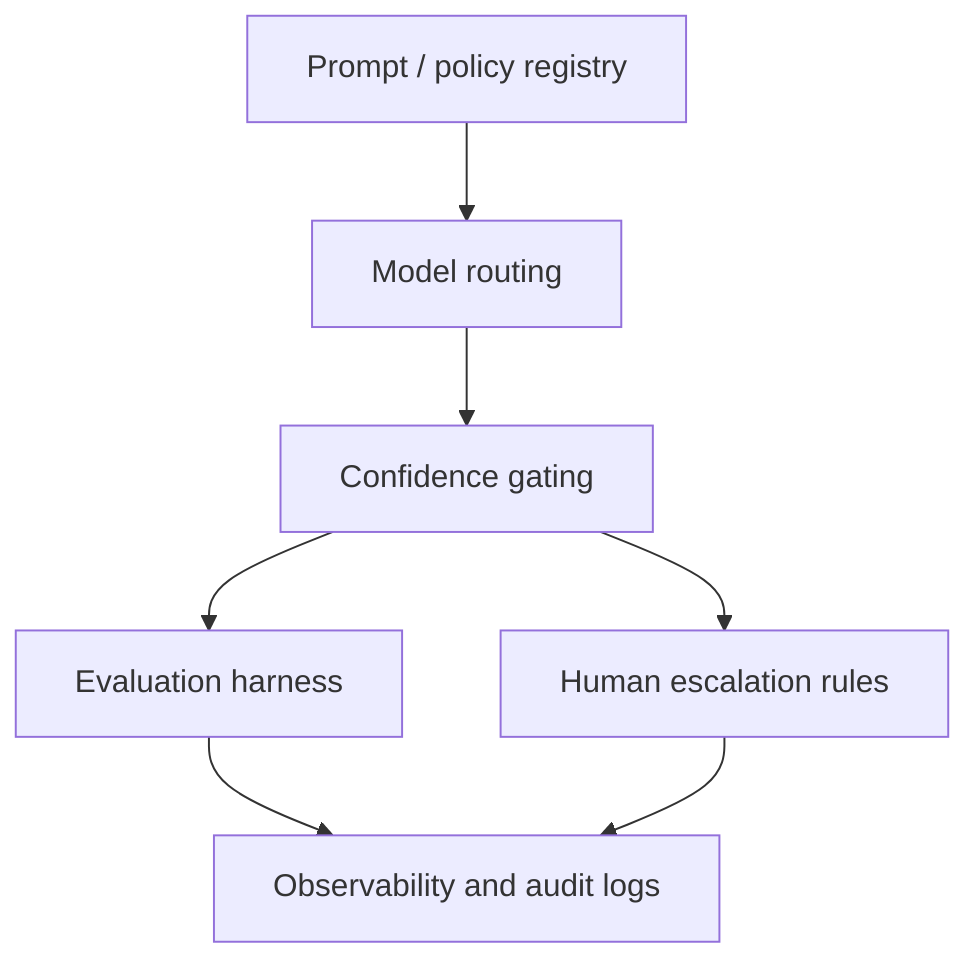

# AI Service Pipeline

## Summary

The AI layer should be implemented as a governed pipeline of specialized services, not as a single conversational assistant. Each service produces structured outputs that feed the next stage and are persisted for review, orchestration, and auditability.

## AI Pipeline Stages

1. OCR and parsing
2. Question extraction
3. Intent classification
4. Ontology mapping
5. Historical precedent retrieval
6. Response strategy generation
7. Task explosion and workflow graph generation
8. Evidence sufficiency validation
9. Draft response generation
10. Learning feedback and evaluation

## AI Service Flow

## Service Responsibilities

### OCR and Parsing

- extract text, page references, tables, headers, and layout zones
- preserve source-page linkage
- produce machine-usable document segments

### Question Extraction

- identify question blocks
- split compound requests into sub-questions
- emit question IDs and source spans

### Intent Classification

- classify request intent
- assess risk and sensitivity
- estimate confidence and review need

### Ontology Mapping

- map questions to jurisdiction, authority, entity, tax topic, process, system, evidence type, owner, and review rules
- normalize terms for retrieval and workflow generation

### Historical Precedent Retrieval

- retrieve similar prior questions and accepted responses
- retrieve related templates, evidence packs, and outcome notes
- use hybrid search over vector, keyword, and metadata filters

### Response Strategy Generation

- infer regulator concern and response objective
- propose evidence plan, systems, owners, approvals, and drafting posture
- produce a structured strategy object rather than narrative only

### Task Explosion / Workflow Graph Generation

- convert strategy into dependency-aware tasks
- attach evidence expectations, inputs, owners, and review requirements
- create a machine-executable workflow graph

### Evidence Sufficiency Validation

- evaluate completeness, relevance, freshness, entity match, and contradiction risk
- identify gaps and unresolved claims
- recommend escalation, more collection, or proceed-to-draft

### Draft Response Generation

- produce narrative answer grounded in approved evidence
- include citations, caveats, and attachment references
- preserve question-level traceability

## AI Control Plane

## Structured Outputs by Stage

- OCR stage: document spans, page map, table objects, extraction confidence
- question stage: question list, sub-question relations, source spans
- classification stage: intent labels, risk, confidence, review trigger
- ontology stage: canonical metadata map
- retrieval stage: ranked precedent set with evidence references
- strategy stage: response objective, evidence plan, risk notes, draft guidance
- workflow stage: DAG of tasks and dependencies
- sufficiency stage: pass/gap/contradiction findings with rationale
- drafting stage: response text plus citations and caveats

## Learning Feedback Loop

The feedback loop should not train directly from every human edit. It should capture:

- accepted vs rejected AI classifications
- strategy edits
- evidence sufficiency overrides
- reviewer comments
- submission outcomes
- precedent usefulness ratings

These artifacts improve prompts, retrieval ranking, ontology coverage, and workflow templates.
