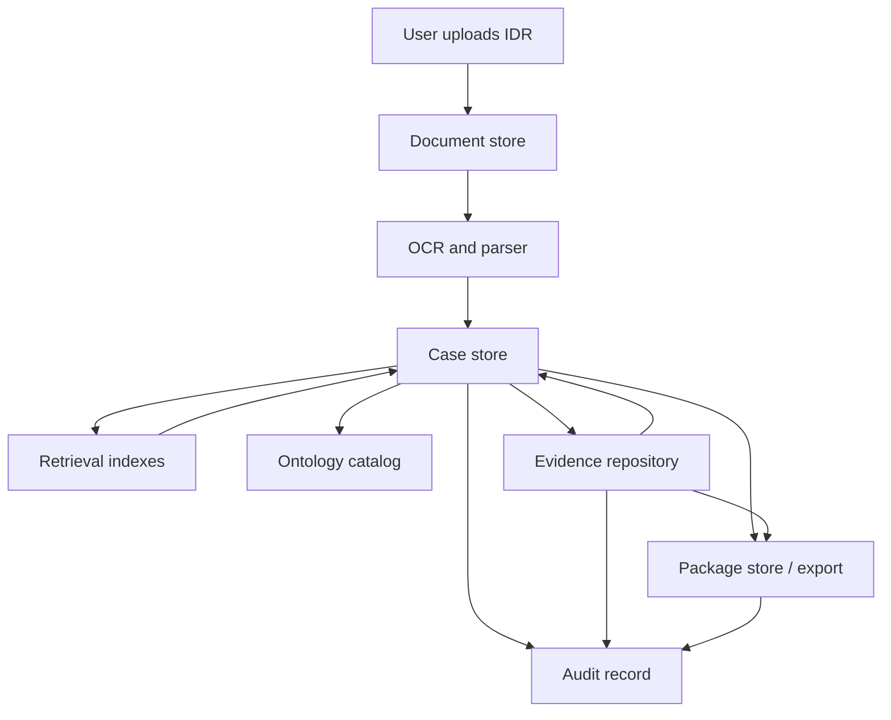
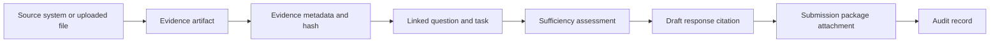
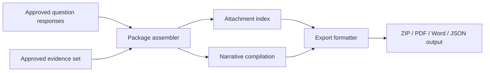

# Data Flow Architecture

## Summary

The platform requires a case-centric data flow that connects unstructured source documents, structured case objects, retrieved precedents, evidence artifacts, review decisions, and final package outputs. Data flow must preserve lineage across every transformation.

## End-to-End Data Flow

```mermaid
flowchart LR
    A[IDR source document]
    B[OCR text + layout objects]
    C[Question records]
    D[Classification and ontology metadata]
    E[Strategy and workflow records]
    F[Evidence artifacts and metadata]
    G[Sufficiency findings]
    H[Draft responses]
    I[Review decisions]
    J[Submission package]
    K[Feedback records]

    A --> B --> C --> D --> E --> F --> G --> H --> I --> J --> K
```

## Canonical Data Stores

- document store for source files and extracted artifacts
- structured case store for IDRs, questions, strategies, tasks, reviews, and packages
- evidence repository for uploads, retrieved reports, and attachments
- vector and search indexes for precedent and evidence retrieval
- ontology catalog for canonical dimensions and controlled vocabularies
- audit record store for versions, approvals, lineage, and decisions

## Detailed Data Flow

## Evidence Lineage Flow

## Data Contract Expectations

Each material object should carry:

- stable identifier
- audit / case ID
- source reference
- owner or responsible role
- version
- confidence or approval status where applicable
- timestamps
- lineage pointers to upstream and downstream objects

## Package Generation Flow

## Data Governance Notes

- keep evidence content separate from evidence metadata
- index only authorized content for retrieval
- store all review and approval events in the audit record
- treat exported submission packages as versioned immutable artifacts
