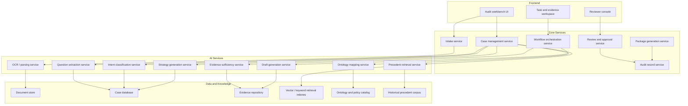
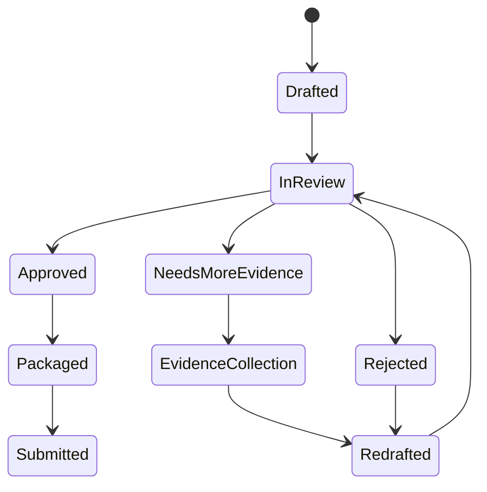
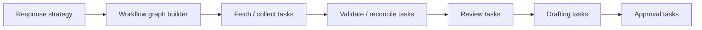

# System Components

## Summary

The platform should be decomposed into business-capable services aligned to the audit response lifecycle. Components should communicate through structured case objects and event-driven workflow updates rather than free-form chat context.

## Component Map

## Component Responsibilities

### Intake Service

- receive IDR uploads and metadata
- create initial case shell
- trigger OCR and parsing jobs

### Case Management Service

- manage IDR, notice, question, sub-question, and strategy objects
- coordinate structured state across the lifecycle

### Workflow Orchestration Service

- generate and execute dependency-aware tasks
- manage owner assignments, SLAs, escalations, and completion criteria

### Review and Approval Service

- manage human review states
- record comments, edits, approvals, rejections, and return-for-work actions

### Package Generation Service

- assemble approved narrative, attachments, indexes, and export formats

### Audit Record Service

- preserve versions, lineage, approvals, and immutable history

### AI Services

- perform bounded specialized analysis steps
- emit structured outputs with confidence and rationale metadata

## Human-in-the-Loop Review Flow

## Task Orchestration Flow

## Integration Boundaries

- source systems feed evidence, not final business logic
- AI services do not own lifecycle state; core services do
- package generation depends only on approved objects
- audit record is the authoritative source for lineage and decision history
