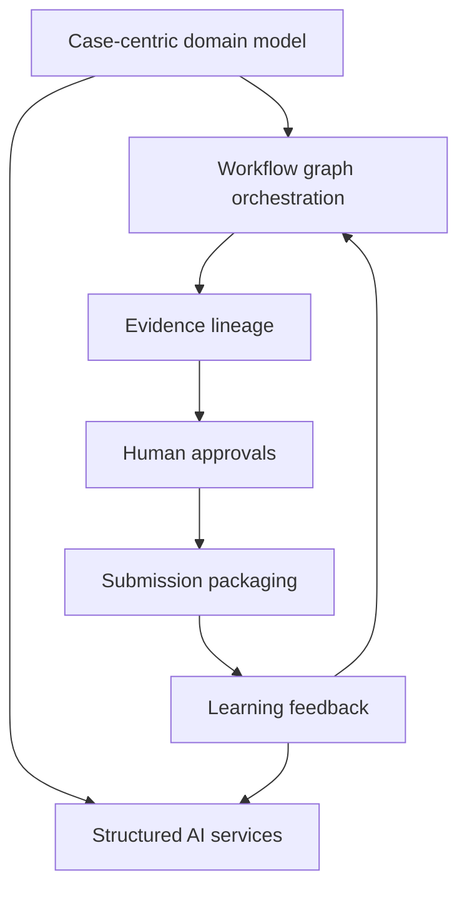

# Architecture Decisions

## Summary

This document captures the primary architecture decisions implied by the BRD and extracted knowledge. These decisions should guide implementation and prevent the platform from collapsing into a generic document chatbot.

## ADR-01: Case-Centric Platform, Not Chat-Centric UX

- Decision: model the system around IDR cases, questions, tasks, evidence, reviews, and packages.
- Rationale: the business problem is governed audit response orchestration, not open-ended conversation.
- Consequence: primary UI should be a workbench and reviewer console, with optional assistive chat only as a secondary interaction pattern.

## ADR-02: Strategy Before Drafting

- Decision: require response strategy generation before draft response generation.
- Rationale: the BRD emphasizes interpretation, evidence planning, required teams, approvals, and risks before narrative drafting.
- Consequence: drafts are downstream artifacts of an approved or accepted strategy object.

## ADR-03: Human Approval Gates Are Mandatory

- Decision: keep humans in approval control at question confirmation, evidence adjudication, response approval, and package release.
- Rationale: tax audit responses require accountable judgment and defensibility.
- Consequence: confidence gating and escalation rules must be built into workflow state, not bolted on later.

## ADR-04: Evidence Lineage Is a First-Class Requirement

- Decision: every evidence artifact, citation, attachment, and package output must preserve lineage to source and review history.
- Rationale: evidence traceability is a stated business objective and a core audit defense requirement.
- Consequence: hashes, versioning, source references, and downstream citation links belong in the core data model.

## ADR-05: Hybrid Retrieval Over Authorized Corpora

- Decision: use vector, keyword, and metadata-filtered retrieval for precedents and evidence.
- Rationale: the extracted architecture notes explicitly reference hybrid retrieval and scoped metadata filters.
- Consequence: retrieval must be jurisdiction-aware, audit-aware, and permission-aware.

## ADR-06: Workflow Graph, Not Flat Task List

- Decision: represent investigation work as a dependency-aware workflow graph.
- Rationale: response preparation requires fetch, validate, reconcile, review, and draft dependencies.
- Consequence: orchestration engine must support DAG execution, blocked states, escalations, and rework loops.

## ADR-07: Separate AI Services From Core State Management

- Decision: AI services produce structured outputs, while core platform services own lifecycle state and approvals.
- Rationale: this separation improves auditability, retryability, testing, and control.
- Consequence: case state should not live only inside prompts or model context windows.

## ADR-08: System of Audit Record Is Canonical

- Decision: maintain a durable audit record containing case history, versions, approvals, decisions, and package outputs.
- Rationale: extracted deck materials explicitly call for a system of audit record.
- Consequence: review events, overrides, and package versions must be persisted as authoritative history.

## ADR-09: Evidence Sufficiency Validation Is Explicit

- Decision: implement evidence sufficiency as a named service and decision object.
- Rationale: the BRD requires detection of missing evidence, contradictions, and weak support before submission.
- Consequence: drafting should be blocked or flagged when sufficiency fails defined thresholds.

## ADR-10: Learning Loop Updates Knowledge, Not Uncontrolled Models

- Decision: use feedback to improve retrieval, ontology coverage, prompts, templates, and workflow heuristics.
- Rationale: enterprise audit environments need controlled improvement paths.
- Consequence: feedback ingestion should be governed, reviewable, and reversible.

## Decision Alignment Diagram

## Open Decision Areas

- exact OCR and parsing stack for MVP
- canonical initial ontology vocabulary
- primary package export format for first production use
- precedence rules when reviewers disagree on contradictory evidence
- source-system integration depth for MVP versus later phases

## Implementation Guidance

- start with explicit domain objects and workflow states
- keep prompts and model calls narrow and stage-specific
- persist all intermediate outputs that affect downstream judgment
- expose low-confidence and unresolved findings directly to reviewers
- optimize for traceable case execution, not conversational polish
