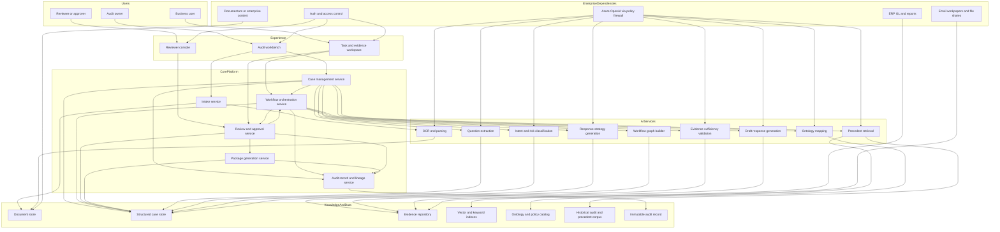

# Improved Architecture From Team Diagram

## Located Team Diagrams

The architecture-related source artifacts I found in the repository are:

- `raw-docs/current-arch-diagrams/7F57278A-4C27-4B7F-8D5F-7B0E69C3730D.JPG`
- `raw-docs/current-arch-diagrams/8F20AF30-A82A-4C02-98AD-2D54682C0C77.JPG`

These appear to be the current team architecture pair:

- a sequence-style workflow diagram showing intake, OCR, categorization, embeddings, vector indexing, response strategy, drafting, and finalization
- a logical/container diagram showing the portal, backend, document storage, AI orchestrator, agent services, semantic layer, storage systems, and Azure OpenAI

I did not modify either original diagram file.

## OCR / Extracted Text

Existing OCR artifacts already present in the repository:

- `extracted_knowledge/ocr_outputs/01_7F57278A-4C27-4B7F-8D5F-7B0E69C3730D.md`
- `extracted_knowledge/ocr_outputs/02_8F20AF30-A82A-4C02-98AD-2D54682C0C77.md`

Key extracted text from the sequence diagram:

- `Login with username & password`
- `Create audit (set scope)`
- `Create document request and upload audit notice`
- `Trigger OCR extraction`
- `Categorise request (static / dynamic / team-routable)`
- `Generate embeddings`
- `Index vector + metadata`
- `Open Response Strategy Advisor`
- `Start audit match`
- `Build prompt + audit match context`
- `Generate response plan`
- `Response plan + tasks`
- `Draft plan for review`
- `Review and edit plan`
- `Save and assign tasks`
- `Start DR response creation`
- `Build prompt + tasks response context`
- `Generate response`
- `Response draft`
- `Draft response for review`
- `Review and edit response`
- `Finalise response for tax authority submission`

Key extracted text from the logical/container diagram:

- `Audit Portal [Container: React]`
- `Audit Backend [Container: Python, FastAPI]`
- `Digital Document Storage [Container: Document Service]`
- `AI Orchestrator [Container: Python, FastAPI]`
- `Audit Data ingestion [Container: Python, FastAPI]`
- `Response Strategy Advisor [Agent: Python, FastAPI]`
- `Response Finalizer [Agent: Python, FastAPI]`
- `Audit Match [Agent: Python, FastAPI]`
- `Semantic Layer`
- `Postgres Vector`
- `ElasticDB`
- `Redis`
- `AuthBlue`
- `Documentum`
- `Azure OpenAI`
- `EAG FIREWALL`

## Summary Of The Current Team Diagram

The current team architecture already moves beyond a generic chatbot. It shows a real audit workflow with a portal, backend, AI orchestrator, asynchronous ingestion, semantic retrieval, a response strategy advisor, and a response finalizer. It also shows some enterprise concerns such as authentication, document persistence, managed storage, and an LLM boundary.

The strongest parts of the current diagrams are:

- explicit intake from an audit portal
- OCR and request categorization
- embeddings and vector indexing
- a precedent-like `audit match` capability
- separate stages for strategy planning and response drafting
- human review on the plan and on the draft

However, the current diagrams are still centered on document processing and agent interactions rather than on a governed case object and full audit lifecycle state. Several target-state requirements are only implied or are missing entirely.

## Comparison Against `/architecture`

Compared with the target architecture in:

- `architecture/00_architecture_overview.md`
- `architecture/02_target_state.md`
- `architecture/03_ai_pipeline.md`
- `architecture/04_data_flow.md`
- `architecture/05_system_components.md`
- `architecture/06_architecture_decisions.md`

the team diagram aligns on:

- OCR and parsing
- retrieval/indexing concepts
- strategy before drafting
- human review before final submission
- container separation between UI, backend, orchestration, and AI-facing services

The team diagram falls short of the target state because the target architecture requires a case-centric, evidence-governed, workflow-driven platform with durable lineage and explicit review controls. The team diagram mostly shows service interactions, not the full governed domain model and lifecycle.

## Gap Analysis

### Missing Components

- Case management service and structured case store
- Workflow orchestration engine with dependency-aware DAG execution
- Review and approval service as a first-class component
- Evidence repository separated from simple document storage
- Audit record / lineage store as canonical history
- Submission packaging service
- Ontology and policy catalog as a governed data asset
- Evidence sufficiency evaluator as a named service
- Feedback / evaluation subsystem for controlled learning

### Missing Data Flows

- source document to structured question records
- question records to ontology metadata
- strategy to workflow graph / executable task graph
- evidence artifact to sufficiency findings
- evidence artifact to citations to package attachment lineage
- review decisions flowing back into rework and orchestration
- package output into immutable audit record
- feedback outputs into prompt, retrieval, and ontology improvement

### Missing Human Review

- confirmation gate for low-confidence extraction or question splitting
- strategy approval gate for sensitive or high-risk questions
- evidence adjudication gate for contradictions or missing support
- package release approval as a separate explicit step
- durable storage of comments, overrides, approvals, and rejections

### Missing Evidence Validation

- evidence sufficiency scoring or pass/gap decisioning
- contradiction detection across evidence sources
- freshness, entity match, jurisdiction match, and completeness checks
- enforcement that drafting uses accepted evidence only

### Missing Ontology

- explicit ontology mapper service
- controlled vocabulary for tax topic, jurisdiction, entity, process, evidence type, owner, and review rules
- ontology-backed normalization before retrieval and task generation

### Missing Precedent Retrieval

- current `audit match` is a useful start, but the target requires a richer precedent retrieval layer
- retrieval of accepted prior responses, evidence packs, playbooks, templates, and outcome notes
- hybrid retrieval with vector, keyword, and metadata filters over authorized corpora

### Missing Task Orchestration

- task graph generation from response strategy
- blocked / waiting / escalated / rework states
- owner assignments, SLAs, dependencies, and completion criteria
- orchestration loops from review back to evidence or drafting

### Missing Audit Traceability

- immutable versioning for evidence, drafts, decisions, and package outputs
- stable IDs and lineage pointers for every material object
- source span or page references carried from OCR through final response
- authoritative audit history of who changed what, when, and why

## Improved Architecture Proposal

The improved architecture should preserve the team’s existing strengths while restructuring the platform around explicit domain objects and governed lifecycle control.

### Design Direction

- keep the existing portal, backend, AI orchestration, semantic retrieval, and Azure OpenAI integration concepts
- introduce a case-centric core platform that owns state, approvals, lineage, and packaging
- turn agent outputs into structured records instead of free-form intermediate steps
- add explicit evidence operations, workflow orchestration, and audit record services
- promote the semantic layer into a governed ontology and precedent knowledge plane

### Improved Logical Architecture

### Improved End-To-End Flow

```mermaid
flowchart LR
    A[IDR notice or source document] --> B[Intake and case creation]
    B --> C[OCR and layout parsing]
    C --> D[Question extraction and decomposition]
    D --> E[Human confirmation when low confidence]
    E --> F[Intent risk and ontology mapping]
    F --> G[Precedent retrieval and audit match]
    G --> H[Response strategy generation]
    H --> I[Strategy review and approval]
    I --> J[Workflow graph and task orchestration]
    J --> K[Evidence collection from enterprise sources]
    K --> L[Evidence validation and sufficiency assessment]
    L --> M{Evidence sufficient?}
    M -->|No| N[Gap tasks escalation and rework]
    N --> J
    M -->|Yes| O[Draft response generation with citations]
    O --> P[Human review edit and approval]
    P --> Q{Approved?}
    Q -->|No| R[Return to strategy evidence or drafting]
    R --> J
    Q -->|Yes| S[Submission package assembly]
    S --> T[Final release approval]
    T --> U[Submission output plus immutable audit record]
    U --> V[Feedback evaluations precedent updates and ontology improvements]
```

## Proposed Service Responsibilities

### Case Management

- create and manage case, notice, question, sub-question, strategy, review, and package objects
- hold canonical lifecycle state outside model context

### Workflow Orchestration

- convert strategy into dependency-aware tasks
- manage owner assignment, SLA, escalations, blocked states, and rework loops

### Evidence Operations

- collect, normalize, and store evidence artifacts and metadata
- link every artifact to case, question, task, and source system

### Review And Approval

- manage explicit human gates for extraction, strategy, evidence, draft, and final release
- capture comments, overrides, rationale, and approvals durably

### Audit Record

- store versions, hashes, citations, source spans, approvals, package outputs, and decision provenance
- serve as the canonical traceability layer

## Migration From The Team Diagram

The lowest-risk path is to evolve the current design rather than replace it.

1. Keep the current portal, backend, OCR pipeline, embeddings, vector store, and Azure OpenAI integration.
2. Add structured case, question, strategy, task, evidence, review, and package objects.
3. Recast `Audit Match`, `Response Strategy Advisor`, and `Response Finalizer` as bounded services in a pipeline governed by case state.
4. Add an explicit workflow orchestration service and evidence sufficiency service.
5. Introduce an immutable audit record and first-class package generation.
6. Expand the semantic layer into an ontology and policy catalog plus precedent corpus.

## Recommended Priority Gaps To Close First

- case management and structured case store
- workflow orchestration and task DAG generation
- evidence repository plus sufficiency validation
- immutable audit record and lineage model
- explicit review and approval service
- ontology mapping and governed precedent retrieval

## Conclusion

The team diagram is a strong foundation for AI-assisted audit response preparation, especially around ingestion, retrieval, strategy, drafting, and review. The main improvement needed is to shift from an agent-and-pipeline view to a governed case-centric platform with explicit workflow, evidence validation, ontology, precedent management, and audit traceability.
