# Data Model Overview

## Purpose

This folder defines the canonical data model for the Finance Audit Management (`FAM`) platform focused on Individual Document Request (`IDR`) intake, decomposition, evidence collection, response preparation, human review, and submission packaging.

The model is designed around these principles:

- case-centric, not document-centric
- every transformation is traceable
- human review and approvals are first-class
- AI services produce structured outputs, not opaque text only
- evidence lineage is preserved from source to final package

## Core Lifecycle

```mermaid
flowchart LR
    A["IDR Intake"] --> B["Question Extraction"]
    B --> C["Intent Classification"]
    C --> D["Ontology Mapping"]
    D --> E["Historical Precedent Retrieval"]
    E --> F["Response Strategy"]
    F --> G["Task Execution"]
    G --> H["Evidence Validation"]
    H --> I["Draft Response"]
    I --> J["Review"]
    J --> K["Submission Package"]
    K --> L["Audit Trail"]
```

## Canonical Entities

The core entities documented in this folder are:

1. `IDR`
2. `Question`
3. `SubQuestion`
4. `IntentClassification`
5. `OntologyMapping`
6. `HistoricalPrecedent`
7. `ResponseStrategy`
8. `Task`
9. `Evidence`
10. `EvidenceValidation`
11. `DraftResponse`
12. `Review`
13. `SubmissionPackage`
14. `AuditTrailEvent`

## Shared Modeling Conventions

All entities should follow the same baseline conventions where applicable:

- `id`: stable unique identifier
- `status`: current lifecycle state from a controlled vocabulary
- `createdAt`: ISO 8601 timestamp
- `updatedAt`: ISO 8601 timestamp
- `createdBy`: actor or service that created the record
- `version`: monotonic version number
- `metadata`: optional extension object for non-canonical attributes

## Common Data Types

| Type | Meaning |
| --- | --- |
| `string` | text, identifiers, enums, URIs |
| `integer` | whole numbers |
| `number` | decimal values such as scores |
| `boolean` | true or false |
| `object` | nested structure |
| `array<T>` | repeated values of type `T` |
| `datetime` | ISO 8601 timestamp |
| `date` | ISO 8601 date |

## Shared Lifecycle Patterns

Not every entity uses the same statuses, but the model follows a common progression:

- `detected`: created by ingestion or automation
- `confirmed`: human or system validated
- `in_progress`: active work is underway
- `ready_for_review`: prepared for human review
- `approved`: accepted and allowed to move forward
- `rejected`: explicitly declined
- `superseded`: replaced by a newer version
- `archived`: retained for audit only

## Cross-Cutting Relationships

- one `IDR` contains many `Question` records
- one `Question` can contain many `SubQuestion` records
- one `Question` usually has one current `IntentClassification`
- one `Question` usually has one current `OntologyMapping`
- one `Question` can reference many `HistoricalPrecedent` records
- one `Question` can have one current `ResponseStrategy`
- one `ResponseStrategy` can generate many `Task` records
- one `Question` can require many `Evidence` records
- one `Question` can have many `EvidenceValidation` runs
- one `Question` can have many `DraftResponse` versions
- one `DraftResponse` can have many `Review` decisions
- one `SubmissionPackage` bundles many approved responses and evidence items
- every significant state change should emit an `AuditTrailEvent`

## Document Guide

- [01_entities.md](/Users/admin/code/vipul/fam/data_model/01_entities.md)
- [02_relationships.md](/Users/admin/code/vipul/fam/data_model/02_relationships.md)
- [03_json_schemas.md](/Users/admin/code/vipul/fam/data_model/03_json_schemas.md)
- [04_sample_payloads.md](/Users/admin/code/vipul/fam/data_model/04_sample_payloads.md)
- [05_database_design.md](/Users/admin/code/vipul/fam/data_model/05_database_design.md)
